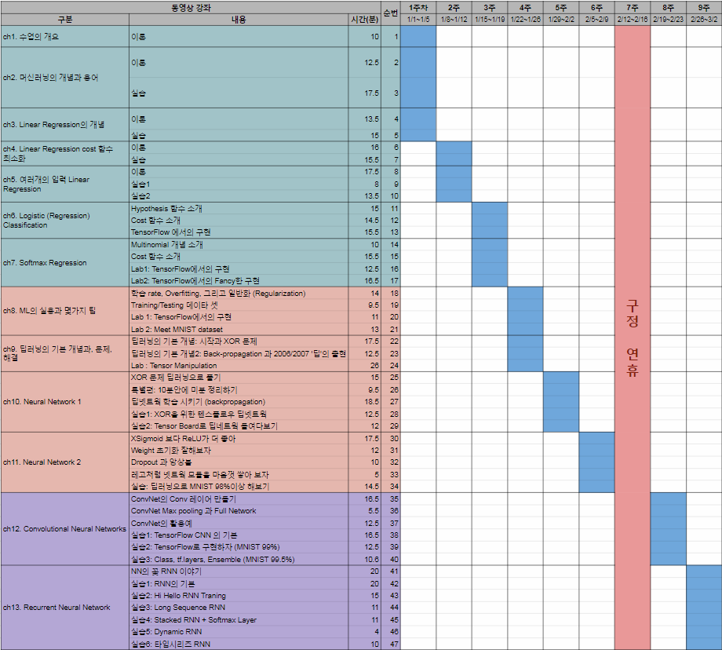

# ML_DL_Tensorflow_study
머신러닝/딥러닝/텐서플로우 스터디

| 개요     | 머신러닝/딥러닝 기초이론 학습 및 텐서플로 실습               |
| ------ | ---------------------------------------- |
| 스터디 교재 | 모두를 위한 머신러닝 강좌 시즌1 (동영상 강의)https://hunkim.github.io/ml/ |
| 스터디 방법 | 각자 동영상 강의로 학습 후 지정된 시간에 모여서 토론학습 범위는 일정표 참조 |
| 토론 시간  | 매주 1회 (금) 오후 1:30 ~ 3:00 (참여 인원 및 교육내용에 따라 가변) |

